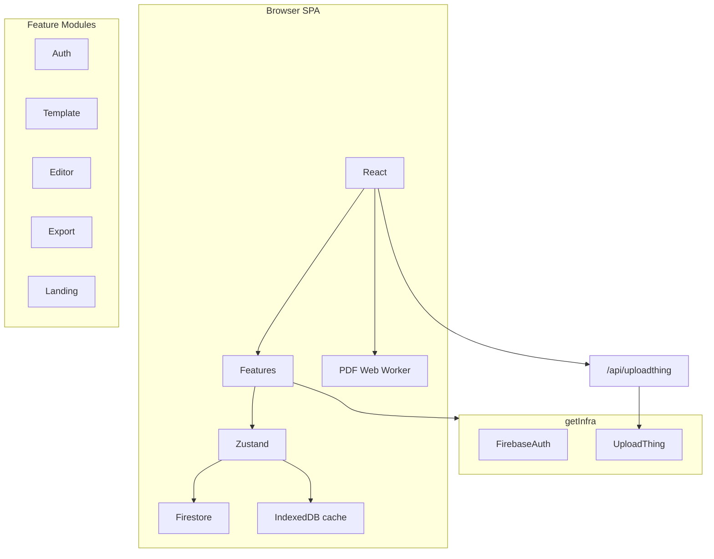
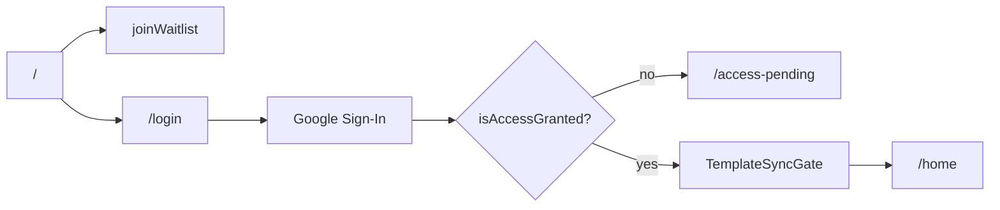
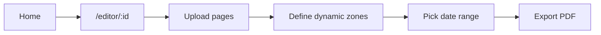

# Dyna — Planner Builder

**Live demo:** [https://planner-maker-spa.vercel.app/](https://planner-maker-spa.vercel.app/)

Dyna is a design-first web app that lets creators upload their own planner artwork, mark where dates should appear, and auto-generate a full dated planner exported as a print-ready PDF.

Built end-to-end as a **Product Engineer** project: product definition, UX/UI, frontend architecture, and production deployment.

`React 19` · `TypeScript` · `Vite` · `Zustand` · `Konva` · `pdf-lib` · `Firebase` · `SCSS`

> **Architecture deep dive:** [docs/ARCHITECTURE.md](docs/ARCHITECTURE.md)

---

## The Problem

Most planner tools force you into fixed templates. Creators who already have custom artwork — covers, monthly spreads, weekly layouts — need a way to add **real calendar logic** on top of their designs without rebuilding everything in a rigid grid.

Dyna bridges that gap: you bring the visuals, the app handles the dates.

### How it works


1. **Upload your design** — covers, monthly or weekly layouts, daily pages
2. **Define dynamic zones** — select exactly where months, days, or years should appear
3. **Choose a date range** — from a few weeks to a full year
4. **Generate automatically** — pages are duplicated, ordered, and filled with correct calendar data, then exported to PDF

---

## What I Built

- **Visual canvas editor** — Konva-based drag/resize with Figma-like snap guides, multi-select, and full undo/redo
- **Calendar generation engine** — locale-aware date logic (EN/ES), configurable week start (Monday/Sunday), ISO or US week numbers
- **Client-side PDF pipeline** — two-phase export (page generation + PDF assembly) off the main thread via a Web Worker
- **Feature-sliced architecture** — five domain modules with ports/adapters, use-case layer, and a central DI bootstrap
- **Auth & early access** — Google sign-in, admin-granted access gate, waitlist collection
- **Cloud-backed persistence** — Firestore realtime sync for templates; UploadThing for page artwork; IndexedDB as client-side image cache

---

## Features

### Shipped

- **Multi-project dashboard** — create, browse, and delete planner projects
- **Page-type system** — cover, month cover, monthly calendar, weekly calendar, daily page, and extra pages — each with type-specific allowed field types
- **Visual editor** — drag, resize, and snap dynamic blocks on a Konva canvas
- **Typed dynamic fields** — year, month, day, and week range (startDay / endDay) with per-page constraints
- **Block styling** — font, color, format variants (numeric vs. name), text case, and alignment per field
- **Pages map** — thumbnail navigation grouped by page type, with drag-to-reorder within each group
- **Undo / redo** — command-pattern history for block and page operations
- **Planner generation** — real calendar logic fills every page for a chosen date range
- **PDF export** — print-ready output matching each page's size and orientation
- **Google sign-in & access gate** — Firebase Auth with admin-controlled early access
- **Waitlist** — landing page signup stored in Firestore
- **Firestore sync** — realtime template metadata sync across sessions and devices
- **Cloud image storage** — UploadThing for page artwork with IndexedDB caching for fast loads
- **Analytics** — Firebase Analytics events for key product actions
- **Desktop editor** — optimized for viewports ≥ 900 × 560 px

### Planned

- Collaboration and planner sharing
- Template library with ready-made layouts
- Premium typography packs and advanced selectors
- Mobile and tablet optimization
- Version history

---

## Architecture at a Glance



The codebase follows a **feature-sliced, hexagonal architecture**: each module owns its domain logic, use cases, UI, and infrastructure adapters. Shared concerns (routing, i18n, UI primitives, DI) live in `src/core/`.

**[Full architecture docs → docs/ARCHITECTURE.md](docs/ARCHITECTURE.md)**

---

## Key User Flows

### Early access & auth



### Edit & export



---

## Product Decisions

| Decision | Trade-off | Outcome |
|----------|-----------|---------|
| **Design-first, not template-first** | More initial setup for the user | Maximum creative freedom — any layout, any artwork |
| **Cloud-backed persistence** | Requires auth and external services | Cross-device sync; Firestore as source of truth; swappable ports for infra |
| **Block-based fields over fixed grids** | More setup per page | Any layout works — fields are placed freely on the canvas |
| **Page-type constraints on field types** | Less flexibility within a page | Reduces user error (weekly pages expose startDay/endDay; covers expose none) |
| **Generation order: week → daily pages within week** | More complex generation logic | Mirrors how people actually use planners day to day |

---

## Design Decisions

| Decision | Detail |
|----------|--------|
| **Token-based theming** | CSS custom properties in `globals.scss` for light/dark modes, sidebar, canvas, and semantic field colors |
| **Semantic field colors** | Purple = year, teal = month, orange = day — instantly scannable on the canvas |
| **Progressive disclosure** | Collapsible sidebar sections; block settings panel appears only when a field is selected |
| **Editor layout** | Dark sidebar + neutral canvas background — familiar mental model from pro design tools |
| **Radix UI + custom SCSS** | Accessible primitives with a bespoke visual identity, not generic component defaults |
| **Motion as polish** | Framer Motion for landing and home page entry; core editor interactions stay static and predictable |

---

## Tech Stack

| Layer | Technologies |
|-------|-------------|
| **Frontend** | React 19, TypeScript, Vite, React Router 6, SCSS |
| **State** | Zustand, React Context (auth), TanStack React Query (scaffolded) |
| **Canvas** | Konva, react-konva, @dnd-kit |
| **Export** | pdf-lib (Web Worker), HTML Canvas |
| **Dates / i18n** | date-fns, dayjs, i18next |
| **UI** | Radix UI, MUI date pickers, Framer Motion, Lucide |
| **Infrastructure** | Firebase (Auth, Firestore, Analytics), UploadThing, IndexedDB (image cache) |
| **Server** | Vercel serverless (`/api/uploadthing`, `/api/images/delete`) |
| **Testing** | Vitest, Testing Library, jsdom |
| **Deploy** | Vercel |

---

## Project Structure

```
src/
├── core/               # Router, i18n, shared UI, DI bootstrap (getInfra)
├── features/
│   ├── auth/           # Google sign-in, access gate, user profile
│   ├── template/       # Domain model, Firestore sync, home dashboard
│   ├── editor/         # Konva canvas, snap guides, undo/redo
│   ├── export/         # PDF generation pipeline
│   └── landing/        # Marketing page, waitlist
├── styles/             # Global SCSS, design tokens
└── test/               # Vitest setup

server/                 # Shared server logic (Firebase Admin, UploadThing router)
api/                    # Vercel serverless entry points
docs/                   # Architecture documentation
```

See [docs/ARCHITECTURE.md](docs/ARCHITECTURE.md) for layer details, domain model, and key file references.

---

## Getting Started

### Prerequisites

- Node.js 18+
- A Firebase project with Google Auth, Firestore, and Analytics enabled

### Setup

```bash
npm install
cp .env.example .env.local   # fill in Firebase credentials
npm run dev                  # http://localhost:8080
npm run test
npm run build
```

### Environment variables

Client-side (prefix `VITE_`): Firebase config, `VITE_IMAGE_STORAGE` (`cloud` for production, `local` for offline dev without UploadThing).

Server-only (for image uploads): `UPLOADTHING_TOKEN`, `FIREBASE_SERVICE_ACCOUNT` or `FIREBASE_SERVICE_ACCOUNT_PATH`.

See [`.env.example`](.env.example) for the full list and [docs/ARCHITECTURE.md#environment-variables](docs/ARCHITECTURE.md#environment-variables) for details.

### Granting access

1. Deploy Firestore rules: `firebase deploy --only firestore:rules` (see [docs/ARCHITECTURE.md#firebase](docs/ARCHITECTURE.md#firebase))
2. Users join the waitlist from the landing page or try the interactive demo at `/landing-demo/home`
3. Admin sets `users/{uid}.isAccessGranted = true` in Firestore Console
4. User signs in with Google and accesses the editor

### Cloud image storage

Production uses `VITE_IMAGE_STORAGE=cloud` with UploadThing + Firebase Admin credentials. The dev server serves upload/delete API routes on the same port (8080). Set `VITE_IMAGE_STORAGE=local` only for offline development without UploadThing. See [docs/ARCHITECTURE.md#integrations](docs/ARCHITECTURE.md#integrations) for the full setup.

---

## Roadmap

### Done

- Core planner generation (upload, define zones, generate, export)
- Firebase auth, waitlist, demo requests, and analytics
- Firestore template sync and UploadThing image storage

### Next

- Extended date logic and advanced page generators
- Premium typography packs and advanced selectors
- Mobile and tablet optimization

### Later

- Collaboration and planner sharing
- Template library
- Version history

---

## About

Dyna was designed and built end-to-end — from product thesis and UX flows to canvas editing, calendar generation, PDF export, cloud sync, and production deployment on Vercel. It demonstrates product thinking, design craft, and frontend engineering in a single cohesive project.

For the full technical story — domain model, state management, export pipeline, and integration details — see **[docs/ARCHITECTURE.md](docs/ARCHITECTURE.md)**.
