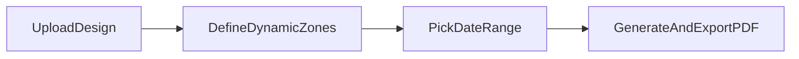
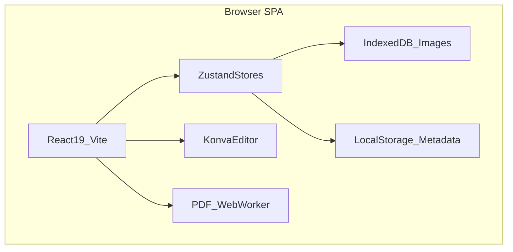

# Dyna — Planner Builder

**Live demo:** [https://planner-maker-spa.vercel.app/](https://planner-maker-spa.vercel.app/)

Dyna is a local-first web app that lets creators upload their own planner designs, mark where dates should appear, and auto-generate a full dated planner exported as a print-ready PDF — no login, no backend.

Built end-to-end as a **Product Engineer** project: product definition, UX/UI, frontend architecture, and deployment.

`React` · `TypeScript` · `Vite` · `Zustand` · `Konva` · `pdf-lib` · `SCSS`

---

## The Problem

Most planner tools force you into fixed templates. Creators who already have custom artwork — covers, monthly spreads, weekly layouts — need a way to add **real calendar logic** on top of their designs without rebuilding everything in a rigid grid.

Dyna bridges that gap: you bring the visuals, the app handles the dates.

### Product thesis

| Decision | Rationale |
|----------|-----------|
| **Design-first, not template-first** | Creators already have artwork; the tool adds calendar logic on top |
| **Local-first / no auth** | Zero friction to start; privacy for personal designs |
| **Generative by nature** | One designed page becomes dozens of correctly dated pages |
| **Modular freemium model** | Free core + paid add-ons (typography, advanced pages, cloud) — pay only for what you need |
| **Print-aware output** | PDF export is a first-class outcome, not an afterthought |

### How it works



1. **Upload your design** — covers, monthly or weekly layouts, daily pages
2. **Define dynamic zones** — select exactly where months, days, or years should appear
3. **Choose a date range** — from a few weeks to a full year
4. **Generate automatically** — pages are duplicated, ordered, and filled with correct calendar data, then exported to PDF

---

## Features

### Shipped

- **Multi-project dashboard** — create, browse, and delete planner projects from a central home screen
- **Page-type system** — upload images for cover, month cover, monthly calendar, weekly calendar, daily page, and extra pages
- **Visual editor** — drag, resize, and snap dynamic blocks on a Konva canvas
- **Typed dynamic fields** — year, month, day, and week range (startDay / endDay) with type-specific constraints per page
- **Block styling** — per-field font, color, format variants (e.g. numeric vs. name), and text case
- **Pages map** — thumbnail navigation grouped by page type, with drag-to-reorder within each group
- **Undo / redo** — full editor history for block and page operations
- **Planner generation** — real calendar logic (Monday week start, ISO weeks) fills every page for a chosen date range
- **PDF export** — A5 landscape output generated off the main thread via a Web Worker
- **Local persistence** — template metadata in localStorage, image blobs in IndexedDB; no server required
- **Desktop editor** — optimized for viewports ≥ 900 × 560 px

### Planned

- Cloud sync and backup across devices
- Collaboration and planner sharing
- Template library with ready-made layouts
- Premium typography packs and advanced selectors
- Mobile and tablet optimization

---

## Product Decisions

Decisions made as a Product Engineer — each with an explicit trade-off.

| # | Decision | Trade-off | Outcome |
|---|----------|-----------|---------|
| 1 | **No backend for v1** | No cross-device sync yet | Faster iteration, zero account barrier, full privacy by default |
| 2 | **Block-based dynamic fields over fixed grids** | More initial setup for the user | Maximum creative freedom — any layout, any artwork |
| 3 | **Page-type system with allowed field types** | Less flexibility within a single page type | Reduces user error (e.g. weekly pages expose startDay/endDay; covers expose none) |
| 4 | **Generation order: week → daily pages within that week** | More complex generation logic | Mirrors how people actually use planners day to day |
| 5 | **Freemium scaffolding in the landing page** | Marketing ahead of full monetization | Communicates roadmap (Free / Pro Add-ons / Cloud) without blocking current free usage |
| 6 | **Bilingual UX** | Mixed language experience | Spanish in editor and home (primary users); English on landing (global reach) |

---

## Design Decisions

| Decision | Detail |
|----------|--------|
| **Token-based theming** | CSS custom properties in `globals.scss` for light/dark modes, sidebar, canvas, and semantic field colors |
| **Semantic field colors** | Purple = year, teal = month, orange = day — instantly scannable on the canvas |
| **Progressive disclosure** | Collapsible sidebar sections; block settings panel appears only when a field is selected |
| **Editor layout** | Dark sidebar + neutral canvas background — familiar mental model from pro design tools |
| **Radix UI + custom SCSS** | Accessible primitives (dialogs, selects, tooltips) with a bespoke visual identity, not generic component defaults |
| **Motion as polish** | Framer Motion for landing and home page entry; core editor interactions stay static and predictable |
| **Typography hierarchy** | Inter for UI chrome; distinct script fonts (Gloria Hallelujah, Great Vibes, Lato) for generated planner text |
| **BEM-style naming** | Component-scoped SCSS with predictable class names (`editor-sidebar__header`) for maintainability |

---

## Technical Decisions

### Architecture



### Key choices

| Area | Choice | Why |
|------|--------|-----|
| **Stack** | React 19 + TypeScript + Vite | Fast developer experience, type-safe domain model |
| **State** | Zustand with persist middleware | Lightweight; no boilerplate for a client-only app |
| **Storage split** | localStorage (metadata) + IndexedDB (images) | Avoids localStorage size limits; lazy-loads images per template |
| **Canvas** | Konva + react-konva | Interactive drag / resize / snap guides, decoupled from DOM layout |
| **Dual render pipeline** | Konva for editor preview, HTML Canvas for generation | Editor stays responsive; PDF output is pixel-accurate |
| **PDF** | pdf-lib in a Web Worker | Keeps the UI thread free during large exports |
| **Calendar logic** | date-fns, Monday week start, ISO week numbers | Predictable, unit-tested (`src/test/daily-page.test.ts`) |
| **Undo / redo** | Command pattern in a separate history store | Clean separation; in-memory only (acceptable for v1) |
| **Future-ready** | React Query wired in App, no queries yet | Reserved for cloud sync without premature complexity |
| **Deploy** | Vercel with SPA rewrites | Zero-config static hosting |

### Tech stack

TypeScript · React 19 · Vite · Zustand · Konva · react-konva · pdf-lib · date-fns · Radix UI · SCSS · Framer Motion · @dnd-kit · Vitest · Vercel

### Key files

| Concern | Path |
|---------|------|
| Domain types | `src/types/planner.ts` |
| Persistence | `src/stores/template-store.ts` |
| Undo / redo | `src/stores/history-store.ts` |
| Calendar & field logic | `src/lib/planner-utils.ts` |
| Planner generation | `src/hooks/use-planner-generator.ts` |
| Canvas editor | `src/components/canvas/TemplateCanvas.tsx` |
| PDF worker | `src/workers/pdf.worker.ts` |
| Design tokens | `src/styles/globals.scss` |

---

## Roadmap

### Now — Core planner generation

- Upload custom images
- Define dynamic areas on a visual canvas
- Generate planners by date range
- Local-first storage
- PDF export

### Next — Advanced generation & customization

- Weekly and advanced page generators
- Extended date logic and rules
- Advanced selectors
- Premium typography packs

### Later — Cloud & collaboration

- Cloud sync across devices
- Backup and restore
- Planner sharing
- Version history

---

## Getting Started

```bash
npm install
npm run dev      # http://localhost:8080
npm run test
npm run build
```

---

## About

Dyna was designed and built end-to-end — from product thesis and UX flows to canvas editing, calendar generation, PDF export, and production deployment. It demonstrates product thinking, design craft, and frontend engineering in a single cohesive project.
