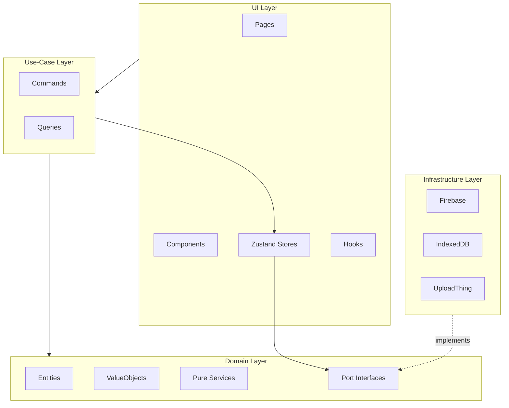
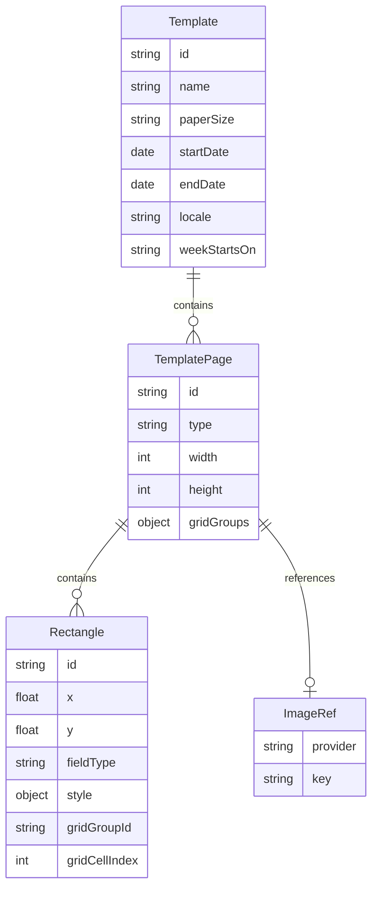
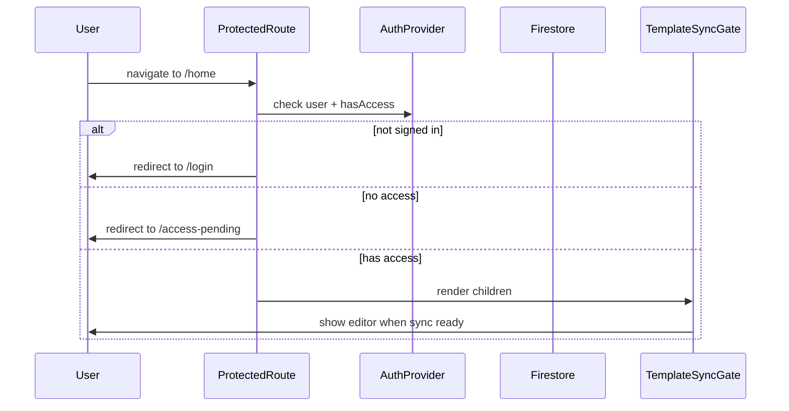
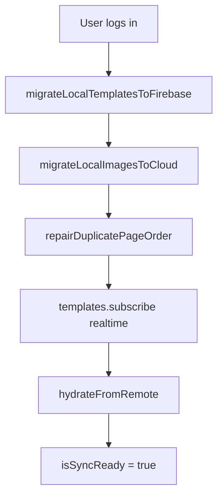
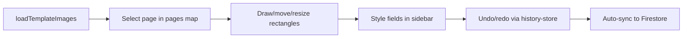
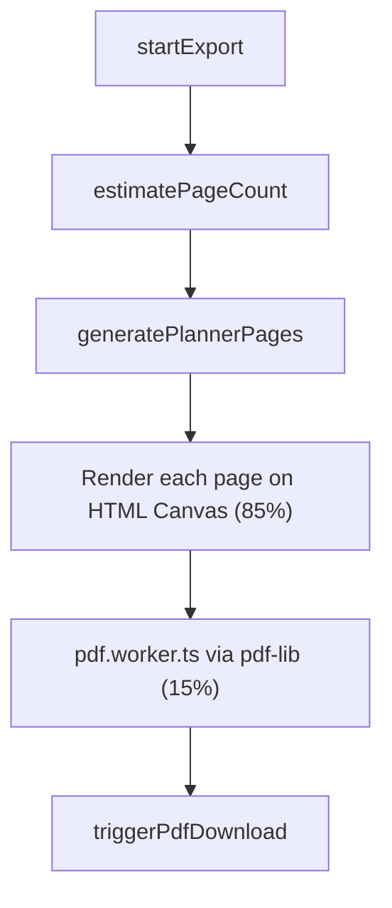
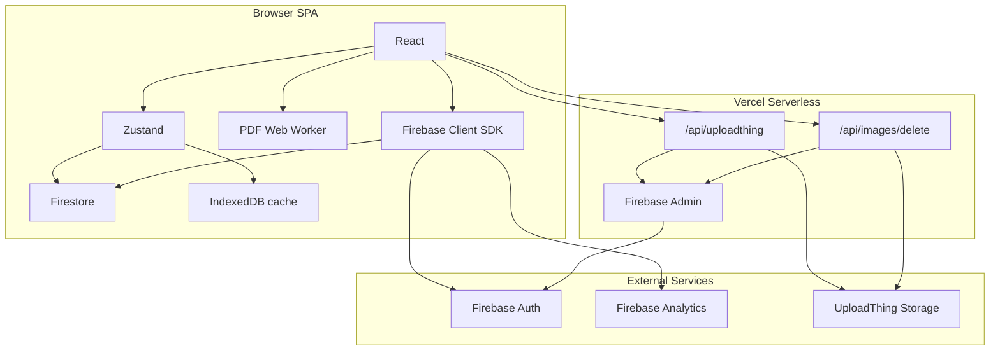

# Architecture

Technical documentation for **Forma — Planner Builder**.

**Back to project overview:** [README.md](../README.md)  
**Product flows (actors & interactions):** [FLOWS.md](./FLOWS.md)

---

## Overview & Principles

Forma is a React SPA organized as **five feature modules** under `src/features/`, each following a consistent layered structure inspired by **Clean/Hexagonal architecture**:

```
features/<name>/
├── domain/           # Entities, value objects, ports (interfaces), pure services
├── infrastructure/   # Firebase, IndexedDB, UploadThing adapters
├── use-case/         # Commands & queries (application layer)
└── ui/               # Pages, components, hooks, Zustand stores
```

Shared, feature-agnostic code lives in `src/core/` (routing, i18n, UI primitives, DI bootstrap).

### Design principles

| Principle | Implementation |
|-----------|---------------|
| **Domain-first** | Business logic (calendar math, page ordering, export pipeline) lives in pure domain services, not React components |
| **Ports & adapters** | Infrastructure is behind interfaces (`AuthPort`, `TemplateRepositoryPort`, `ImageAssetPort`); swap Firebase for another provider by adding a new adapter |
| **Feature isolation** | Each module exposes a public API via `index.ts`; cross-feature imports go through barrels |
| **Cloud-backed** | Firestore for template metadata; UploadThing for page artwork in production; IndexedDB as client-side image cache |
| **Composition root** | All adapters wired in one place: `src/core/bootstrap/infra.ts` via `getInfra()` |

### Layer diagram



---

## Feature Modules

| Module | Path | Domain entities | Responsibilities |
|--------|------|-----------------|------------------|
| **template** | `src/features/template/` | Template, TemplatePage, Rectangle, GridGroup, ImageRef, PaperSize | CRUD, page ordering, paper size, Firestore sync, home dashboard, analytics |
| **editor** | `src/features/editor/` | (operates on template entities) | Konva canvas, snap guides, grid tool, selection, undo/redo, zoom/pan |
| **export** | `src/features/export/` | PlannerConfig, GeneratedPage | Page generation, PDF assembly, export progress |
| **auth** | `src/features/auth/` | AuthUser, UserProfile (ports) | Google sign-in, access gate, user profile |
| **landing** | `src/features/landing/` | JoinWaitlistInput | Marketing page, waitlist signup, interactive demo |

Each feature exports a barrel file at `src/features/<name>/index.ts`.

---

## Domain Model

### Entity relationships



### Template

A **Template** is a planner project: a named collection of pages with optional date range and locale settings.

```typescript
// src/features/template/domain/entities/template.ts
interface Template {
  id: string;
  name: string;
  description?: string;
  images: TemplatePage[];
  paperSize?: PaperSize;        // e.g. 'A4' | 'A5' — drives export raster/PDF size
  createdAt: Date;
  updatedAt: Date;
  startDate?: Date;
  endDate?: Date;
  locale?: PlannerLocale;      // 'en' | 'es'
  weekStartsOn?: WeekStartsOn;  // 'monday' | 'sunday'
}
```

### TemplatePage

A **TemplatePage** is one uploaded page image with metadata and dynamic field zones.

```typescript
// src/features/template/domain/entities/template-page.ts
interface TemplatePage {
  id: string;
  name: string;
  type: TemplateType;
  width: number;
  height: number;
  rectangles: Rectangle[];
  gridGroups?: Record<string, GridGroup>; // optional grid layouts of fields
  createdAt: Date;
  updatedAt: Date;
  src: string;           // data URL or blob URL for display
  imageRef?: ImageRef;   // storage pointer (local or cloud)
  missingLocalAsset?: boolean;
}
```

### Page types and allowed field types

Each page type constrains which dynamic fields can be placed, reducing user error:

| Page type | Allowed fields |
|-----------|---------------|
| `cover` | (none) |
| `month-cover` | year, month |
| `monthly-calendar` | year, month, day |
| `weekly-calendar` | year, month, day, startDay, endDay |
| `daily-page` | year, month, day |
| `extra` | (none) |

Defined in `src/features/template/domain/constants/template-field-types.ts`.

Pages are ordered by type priority: cover → month-cover → monthly-calendar → weekly-calendar → daily-page → extra (`template-image-order.ts`).

### Rectangle

A **Rectangle** is a dynamic field zone on a page — a positioned area where calendar data is rendered during generation.

```typescript
// src/features/template/domain/entities/rectangle.ts
interface Rectangle {
  id: string;
  x: number;
  y: number;
  width: number;
  height: number;
  fieldType: FieldType;       // 'year' | 'month' | 'day' | 'startDay' | 'endDay'
  order: number;
  formatVariant?: FormatVariant;
  style?: FieldStyle;         // font, color, bold, italic, textCase, textAlign
  gridGroupId?: string;
  gridCellIndex?: number;
}
```

### Value objects

| Value object | Values | Purpose |
|-------------|--------|---------|
| `PlannerLocale` | `en`, `es` | Month/weekday name formatting |
| `WeekStartsOn` | `monday`, `sunday` | Calendar grid and week number calculation |
| `TemplateType` | 6 page types | Page categorization and field constraints |
| `FieldType` | 5 field types | Dynamic zone type |
| `FieldStyle` | font, color, bold, italic, textCase, textAlign | Per-field typography |
| `PaperSize` | e.g. `A4`, `A5` | Print size for export rasterization and PDF pages |
| `GridGroup` | cols/rows/bounds/settings | Grid of field rectangles on a page |
| `ImageRef` | provider + key (+ optional url/fileKey) | Storage pointer (`local`, `uploadthing`; type also allows `firebase` / `r2`) |

---

## Application Layer (Use Cases)

The use-case layer provides thin **command/query facades** over Zustand stores or infrastructure ports.

### Pattern

```typescript
// Commands mutate state or trigger side effects
export function createTemplate(name: string, paperSize: PaperSize, description?: string) {
  return useTemplateStore.getState().createTemplate(name, paperSize, description);
}

// Queries read state
export function getTemplate(id: string) {
  return useTemplateStore.getState().templates.find(t => t.id === id);
}

// Infra-backed commands bypass the store
export function signInWithGoogle() {
  return getInfra().auth.signInWithGoogle();
}
```

### Key use cases by feature

**Template**

| Kind | Operations | File |
|------|------------|------|
| Commands | `createTemplate`, `updateTemplate`, `deleteTemplate`, `hydrateFromRemote` | `use-case/commands/template.commands.ts` |
| Commands | `addImage`, `updateImage`, `deleteImage`, `reorderImages` | `use-case/commands/page.commands.ts` |
| Commands | `addRectangle`, `updateRectangle`, `deleteRectangle` | `use-case/commands/rectangle.commands.ts` |
| Commands | `migrateLocalTemplatesToFirebase`, `migrateLocalImagesToCloud` | `use-case/commands/sync.commands.ts` |
| Commands | `trackEvent`, `trackPageView` | `use-case/commands/analytics.commands.ts` |
| Queries | `getTemplate`, `listTemplates`, `getCurrentImage` | `use-case/queries/template.queries.ts` |

**Editor**

| Kind | Operations | File |
|------|------------|------|
| Commands | Selection, canvas tool, guides | `use-case/commands/selection.commands.ts` |
| Queries | `getCurrentImageId`, `getSelectedRectangleIds` | `use-case/queries/editor-session.queries.ts` |

**Export**

| Kind | Operations | File |
|------|------------|------|
| Commands | `exportPlanner`, `openGenerator`, `closeGenerator` | `use-case/commands/export-planner.command.ts` |

**Auth**

| Kind | Operations | File |
|------|------------|------|
| Commands | `signInWithGoogle`, `signOut` | `use-case/commands/sign-in-with-google.ts` |
| Queries | `getCurrentUser`, `checkAccess` | `use-case/queries/get-current-user.ts` |

**Landing**

| Kind | Operations | File |
|------|------------|------|
| Commands | `joinWaitlist` | `use-case/commands/join-waitlist.ts` |
| Commands | `openDemoTemplate` | `use-case/commands/open-demo-template.ts` |

---

## State Management

### Zustand stores

| Store | Path | Scope |
|-------|------|-------|
| **template-store** | `src/features/template/ui/stores/template-store.ts` | In-memory working copy; persists to Firestore via realtime sync |
| **editor-store** | `src/features/editor/ui/stores/editor-store.ts` | Session UI: selected rectangles, canvas tool, current page |
| **history-store** | `src/features/editor/ui/stores/history-store.ts` | Undo/redo via command pattern; in-memory, per template |
| **export-store** | `src/features/export/ui/stores/export-store.ts` | Export lifecycle: progress, cached pages, PDF blob URL |

### React Context

**AuthProvider** (`src/features/auth/ui/contexts/auth-provider.tsx`) manages:
- Firebase auth state (`user`)
- Firestore user profile (`profile`)
- Derived `hasAccess` (from `profile.isAccessGranted`)
- `signIn` / `signOut` actions

### State split rationale

| Concern | Store | Why separate |
|---------|-------|-------------|
| Planner data | template-store | Persisted, synced, shared across editor and export |
| Editor session | editor-store | Ephemeral UI state; resets on navigation |
| History | history-store | In-memory only; large undo stacks shouldn't persist |
| Export job | export-store | Independent lifecycle with progress and caching |

React Query is **not** used in the app today (`App.tsx` only wraps `AuthProvider` + MUI `LocalizationProvider`).

---

## Key Flows

Detalle de actores e interacciones: **[FLOWS.md](./FLOWS.md)**. Resumen técnico abajo.

### 1. Auth & access gate



**Files:**
- `src/features/auth/ui/components/protected-route.tsx` — route guard
- `src/features/template/ui/components/template-sync-gate.tsx` — blocks UI until sync completes

**Access model:**
1. User signs in with Google → profile upserted in `users/{uid}` with `isAccessGranted: false`
2. Admin sets `isAccessGranted: true` in Firestore Console
3. `ProtectedRoute` checks `hasAccess` before rendering editor routes

### 2. Template sync & migration

On login with access granted, `useTemplateSync` runs:



**Steps:**
1. **Template migration** — one-time localStorage → Firestore for projects created before cloud sync
2. **Image migration** — one-time IndexedDB blobs → UploadThing (when enabling cloud storage)
3. **Order repair** — fix duplicate page order indices from migration edge cases
4. **Realtime subscribe** — Firestore listener pushes remote changes into `template-store`

**Files:**
- `src/features/template/ui/hooks/use-template-sync.ts`
- `src/features/template/domain/services/template-migration.ts`
- `src/features/template/use-case/commands/sync.commands.ts`

### 3. Editor session



**Key components:**
- `TemplateEditor.tsx` — page shell
- `TemplateCanvas.tsx` — Konva canvas with drag, resize, snap, zoom/pan
- `editor-sidebar.tsx` — field type selector and style controls
- `pages-map.tsx` — thumbnail navigation with drag-to-reorder
- Grid overlays/handles — cols/rows/gaps/alignment for field grids

**Hooks:**
- `use-manage-images.ts` — upload, delete, reorder pages
- `use-manage-areas.ts` — rectangle CRUD
- `use-grid-group-ops.ts` — grid group editing
- `use-undo-redo-shortcuts.ts` — keyboard shortcuts

### 4. PDF export pipeline

The export pipeline runs entirely client-side in two phases:



**Phase 1 — Page generation (main thread, ~85% progress):**

For each month in the date range:
1. Emit cover pages
2. Emit month covers and monthly calendars
3. For each week: emit weekly calendar, then daily pages for days in that week
4. Emit extra pages

Each page is rendered by:
1. Loading the template page image
2. Drawing each rectangle's field value via `renderFieldOnCanvas` (HTML Canvas)
3. Producing a PNG data URL

**Phase 2 — PDF assembly (Web Worker, ~15% progress):**

1. Spawn module Worker with page PNG data URLs
2. Worker embeds each PNG as a PDF page via `pdf-lib`
3. Page dimensions come from `template.paperSize` (or inferred size) via `resolvePdfPageSizeForExport` — not necessarily the raw uploaded pixel size
4. Worker posts final `ArrayBuffer` back to main thread
5. Browser download triggered

**Generation order rule:** when both weekly and daily templates exist, pages are emitted **week → daily pages within that week**. This mirrors real planner usage.

**Files:**
- `src/features/export/domain/services/planner-export.ts` — orchestration
- `src/features/export/infrastructure/workers/pdf.worker.ts` — PDF assembly
- `src/features/export/domain/services/pdf-page-size.ts` — dimension logic
- `src/features/editor/domain/services/planner-utils.ts` — calendar math and field rendering (`renderFieldOnCanvas`)
- `src/features/editor/domain/services/field-style-config.ts` — fonts/styles + `resolveCanvasTextX` / `resolveCanvasTextY`
- `src/features/template/domain/services/paper-size.ts` — paper size ↔ pixels/points

**Caching:** if the same template + date range is exported again without changes, cached pages are reused (skipping phase 1).

**Typography note:** export text uses Canvas2D `textBaseline: 'alphabetic'` + `resolveCanvasTextY` (font bounding-box metrics, measuring `'M'`) so vertical centering matches Konva's `verticalAlign="middle"` in the editor.

---

## Integrations

### Architecture diagram



### Firebase

| Service | Usage | Adapter |
|---------|-------|---------|
| **Auth** | Google sign-in via popup | `FirebaseAuthAdapter` |
| **Firestore** | User profiles, templates, pages, waitlist | `FirebaseTemplateRepository`, `FirebaseUserRepository`, `FirebaseWaitlistRepository` |
| **Analytics** | Product event tracking | `FirebaseAnalyticsAdapter` |

**Firestore schema:**

```
users/{uid}
  ├── isAccessGranted: boolean
  ├── email: string
  ├── displayName: string
  └── templates/{templateId}
        ├── name, description, paperSize, pageOrder, locale, weekStartsOn, dates
        └── pages/{pageId}
              ├── type, width, height, imageRef, rectangles, gridGroups
              └── ...
waitlist/{email}
  ├── email: string
  ├── status: 'pending'
  ├── locale: string
  └── source: string
```

**Security rules:** `firestore.rules`
- Users can read/write only their own data (`users/{uid}/**`)
- Waitlist: create-only, deduplicated by email doc ID; no read/update/delete from clients

### UploadThing (cloud image storage)

Production uses `VITE_IMAGE_STORAGE=cloud`. UploadThing is the primary store for page artwork; IndexedDB caches blobs locally for faster reloads (`CachingImageAdapter`).

| Setting | Value |
|---------|-------|
| Route | `plannerImage` |
| Max size | 10 MB |
| Auth | Firebase ID token (input `idToken` or `Authorization: Bearer`) |
| File key | `{uid}/{pageId}` (ownership enforced server-side) |

**Image storage modes:**

| Mode | `VITE_IMAGE_STORAGE` | Storage | Use case |
|------|---------------------|---------|----------|
| Cloud | `cloud` | UploadThing + IndexedDB cache | Production (set explicitly; see `.env.example`) |
| Local | unset / other | IndexedDB only | Offline / local-only image storage |

**Server files:**
- `server/uploadthing/core.ts` — upload router with auth middleware
- `api/uploadthing.ts` — Vercel serverless entry
- `api/images/delete.ts` — image deletion endpoint

### Dev API (local development)

The Vite dev server serves API routes on the same port (8080) via `vite.dev-api-plugin.ts`, which delegates to `server/dev-api.ts`. This mirrors the Vercel serverless routes without needing a separate API server.

**Env loading:** `server/load-env.ts` reads `.env.local` / `.env` for server secrets.

### Composition root

All adapters are wired in `src/core/bootstrap/infra.ts`:

```typescript
export function getInfra(): InfraServices {
  if (!isFirebaseConfigured()) {
    throw new Error('Firebase is not configured. Copy .env.example to .env.local …');
  }
  return {
    auth: new FirebaseAuthAdapter(),
    users: new FirebaseUserRepository(),
    waitlist: new FirebaseWaitlistRepository(),
    analytics: new FirebaseAnalyticsAdapter(),
    templates: new FirebaseTemplateRepository(),
    images: createImageAdapter(),  // Caching(UploadThing, IndexedDB) in cloud mode; IndexedDB only otherwise
  };
}
```

Cloud image mode is enabled only when `VITE_IMAGE_STORAGE === 'cloud'` (`isCloudImageStorageEnabled()`). If unset or any other value, images stay on IndexedDB.

### Analytics events

| Event | Trigger |
|-------|---------|
| `landing_view` | Landing page load |
| `waitlist_join` | Waitlist form submission |
| `demo_cta_click` | Try-demo CTA click (landing → interactive demo) |
| `login` | Google sign-in |
| `planner_created` | New template created |
| `block_added` | Dynamic field placed on canvas |
| `planner_generated` | Export finished successfully (with `pageCount`) |
| `planner_downloaded` | PDF download triggered (same success path as above) |

---

## Dual Render Pipeline

A key frontend engineering decision: the editor and the export use **different rendering engines**, but share the same field model and typography helpers.

| Context | Engine | Why |
|---------|--------|-----|
| **Editor preview** | Konva / react-konva (2D canvas scene graph) | Interactive drag, resize, snap guides, multi-select |
| **PDF generation** | HTML Canvas 2D → PNG → pdf-lib Worker | Deterministic print output; worker only assembles PDF pages |

| Concern | Editor | Export |
|---------|--------|--------|
| Text node | Konva `Text` `verticalAlign="middle"` | `renderFieldOnCanvas` |
| Baseline | Konva non-legacy (alphabetic + font metrics) | `textBaseline: 'alphabetic'` + `resolveCanvasTextY` |
| Horizontal align | Konva `align` | `resolveCanvasTextX` |
| Fonts / styles | `field-style-config` | Same module (`buildCanvasFont`, etc.) |

This keeps the editor responsive while ensuring PDF text sits in the same place as the canvas preview (especially for script fonts with asymmetric ascent/descent).

---

## Technical Design Decisions

| Area | Choice | Rationale | Trade-off |
|------|--------|-----------|-----------|
| **Architecture** | Feature-sliced + hexagonal | Clear boundaries, testable domain, swappable infra | More folders than a flat structure |
| **State** | Zustand | Lightweight, no boilerplate, works well with React 19 | No built-in devtools like Redux |
| **Storage split** | Firestore (metadata) + UploadThing (images) + IndexedDB (cache) | Cloud source of truth with fast local reloads | Depends on Firebase and UploadThing in production |
| **Canvas** | Konva + react-konva | Interactive drag/resize/snap, decoupled from DOM | Learning curve vs. plain Canvas |
| **PDF** | pdf-lib in Web Worker | UI thread stays free during large exports | Worker communication overhead |
| **Calendar logic** | date-fns, unit-tested | Predictable, locale-aware, configurable week start | date-fns bundle size |
| **Undo/redo** | Command pattern in separate store | Clean separation from template data | In-memory only (acceptable for v1) |
| **Image adapter** | Caching wrapper over UploadThing | Transparent IndexedDB cache; same port interface | Cache invalidation complexity |
| **Auth gate** | Admin-granted access in Firestore | Controlled early access without building admin UI | Manual step for each user |
| **Deploy** | Vercel (static + serverless) | Zero-config hosting; API routes for UploadThing auth | Vendor lock-in for serverless |

---

## Testing Strategy

**Framework:** Vitest + jsdom + Testing Library

**Approach:** domain/service unit tests co-located with pure logic. No component tests in v1 — intentional focus on business logic correctness.

### Test files

| File | What it tests |
|------|--------------|
| `src/features/editor/domain/services/planner-week.test.ts` | Week calculation, ISO vs US week numbers |
| `src/features/editor/domain/services/canvas-snap.test.ts` | Snap guide alignment and spacing |
| `src/features/editor/domain/services/canvas-pan.test.ts` | Canvas panning bounds |
| `src/features/editor/domain/services/canvas-viewport.test.ts` | Viewport / zoom math |
| `src/features/editor/domain/services/drag-axis-lock.test.ts` | Axis-locked dragging |
| `src/features/editor/domain/services/grid-layout.test.ts` | Grid cell layout |
| `src/features/editor/domain/services/grid-group.test.ts` | Grid group operations |
| `src/features/editor/domain/services/grid-tool-presets.test.ts` | Grid tool presets |
| `src/features/editor/domain/services/layer-order.test.ts` | Layer ordering |
| `src/features/export/domain/services/pdf-page-size.test.ts` | PDF page dimension logic |
| `src/features/template/domain/services/paper-size.test.ts` | Paper size conversions |
| `src/test/daily-page.test.ts` | Field values, text case, `resolveCanvasTextX` / `resolveCanvasTextY` |

**Run tests:**

```bash
npm run test        # single run
npm run test:watch  # watch mode
```

---

## Environment Variables

### Client-side (Vite — prefix `VITE_`)

| Variable | Required | Default | Purpose |
|----------|----------|---------|---------|
| `VITE_FIREBASE_API_KEY` | Yes | — | Firebase client config |
| `VITE_FIREBASE_AUTH_DOMAIN` | Yes | — | Firebase client config |
| `VITE_FIREBASE_PROJECT_ID` | Yes | — | Firebase client config |
| `VITE_FIREBASE_APP_ID` | Yes | — | Firebase client config |
| `VITE_FIREBASE_MEASUREMENT_ID` | No | — | Firebase Analytics |
| `VITE_INFRA_PROVIDER` | No | `firebase` | Declared; not used in code yet |
| `VITE_IMAGE_STORAGE` | No | unset ⇒ local IndexedDB | Set to `cloud` for UploadThing (as in `.env.example` / production) |
| `VITE_UPLOADTHING_URL` | No | same-origin `/api/uploadthing` | Override upload endpoint |
| `VITE_IMAGE_DELETE_URL` | No | same-origin `/api/images/delete` | Override delete endpoint |

Types defined in `src/vite-env.d.ts`. Template in `.env.example`.

### Server-only (Vercel + local dev API)

| Variable | Required for cloud | Purpose |
|----------|-------------------|---------|
| `UPLOADTHING_TOKEN` | Yes | UploadThing API token |
| `FIREBASE_SERVICE_ACCOUNT` | Yes | Service account JSON (inline or base64) |
| `FIREBASE_SERVICE_ACCOUNT_PATH` | Alt to above | Path to JSON key file (e.g. `firebase-admin-key.json`) |

These are **never** exposed to the client bundle.

---

## Key Files Reference

| Concern | Path |
|---------|------|
| Product flows | `docs/FLOWS.md` |
| DI bootstrap | `src/core/bootstrap/infra.ts` |
| App router | `src/core/routes/app-router.tsx` |
| Route paths | `src/core/routes/paths.ts` |
| Auth provider | `src/features/auth/ui/contexts/auth-provider.tsx` |
| Route guards | `src/features/auth/ui/components/protected-route.tsx` |
| Template store | `src/features/template/ui/stores/template-store.ts` |
| Template sync hook | `src/features/template/ui/hooks/use-template-sync.ts` |
| Template migration | `src/features/template/domain/services/template-migration.ts` |
| Paper size | `src/features/template/domain/services/paper-size.ts` |
| Page type constraints | `src/features/template/domain/constants/template-field-types.ts` |
| Page ordering | `src/features/template/domain/services/template-image-order.ts` |
| Editor store | `src/features/editor/ui/stores/editor-store.ts` |
| History store | `src/features/editor/ui/stores/history-store.ts` |
| Calendar logic | `src/features/editor/domain/services/planner-utils.ts` |
| Field styling / text X·Y | `src/features/editor/domain/services/field-style-config.ts` |
| Grid layout | `src/features/editor/domain/services/grid-layout.ts` |
| Grid groups | `src/features/editor/domain/services/grid-group.ts` |
| Canvas snap | `src/features/editor/domain/services/canvas-snap.ts` |
| Canvas editor | `src/features/editor/ui/components/canvas/TemplateCanvas.tsx` |
| Template editor page | `src/features/editor/ui/pages/TemplateEditor.tsx` |
| Demo template open | `src/features/landing/use-case/commands/open-demo-template.ts` |
| Export store | `src/features/export/ui/stores/export-store.ts` |
| Export orchestration | `src/features/export/domain/services/planner-export.ts` |
| PDF worker | `src/features/export/infrastructure/workers/pdf.worker.ts` |
| PDF page size | `src/features/export/domain/services/pdf-page-size.ts` |
| Firestore rules | `firestore.rules` |
| UploadThing router | `server/uploadthing/core.ts` |
| Firebase Admin | `server/firebase-admin.ts` |
| Dev API plugin | `vite.dev-api-plugin.ts` |
| Design tokens | `src/styles/globals.scss` |

---

## Migration Note

The codebase migrated from a flat structure (`src/components/`, `src/lib/`, `src/stores/`, `src/infrastructure/`) to the current feature-sliced layout (`src/features/`, `src/core/`). That migration is complete; those legacy top-level folders are no longer present. All documentation references the feature module paths above.
