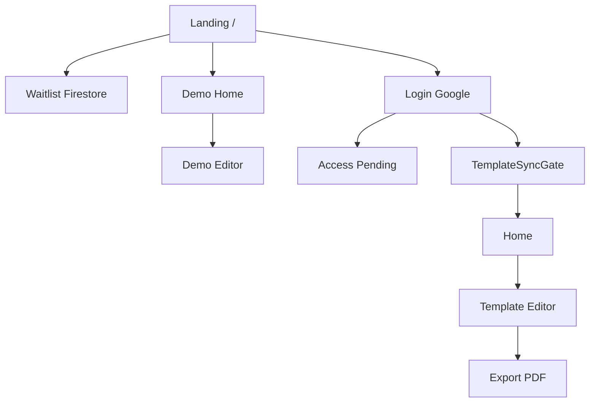
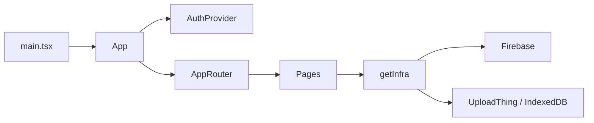
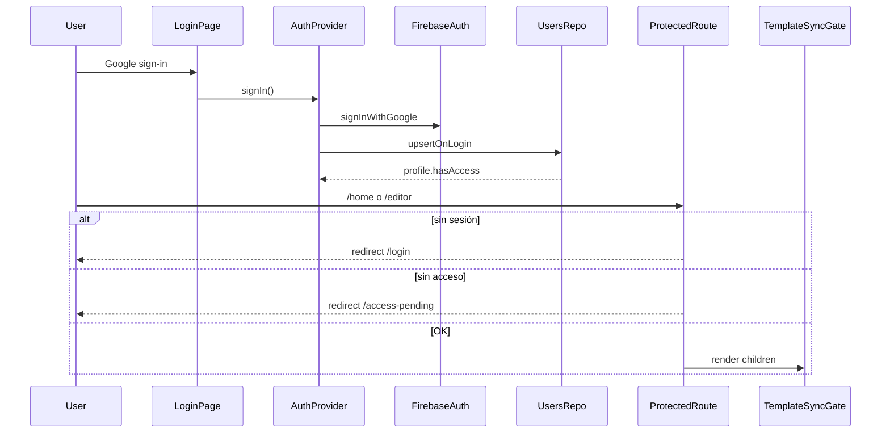
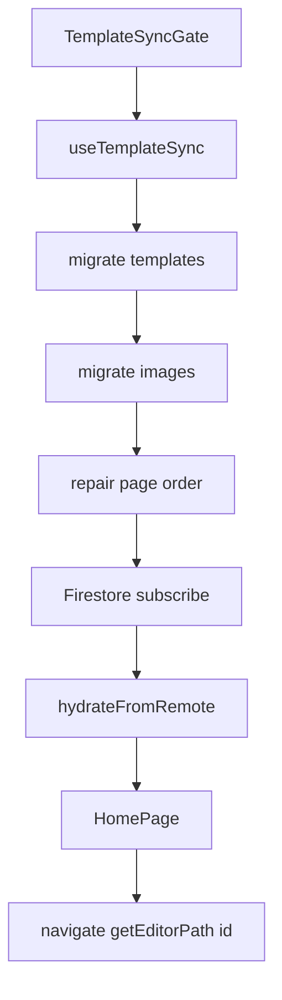
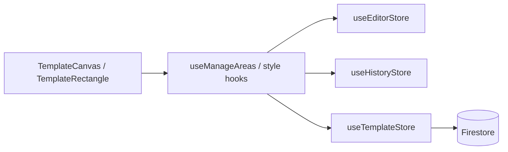
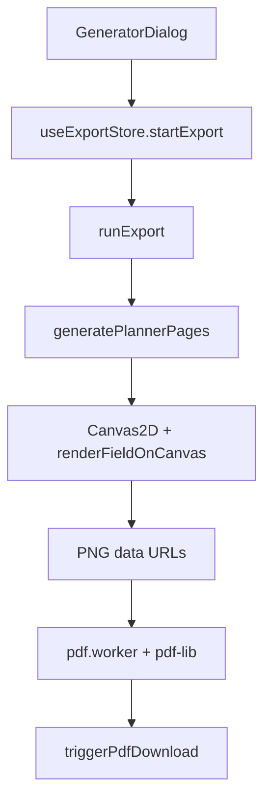
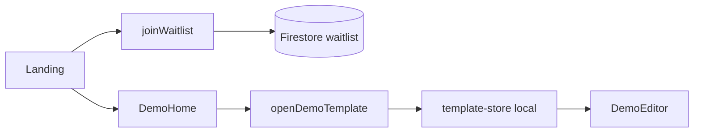

# Flujos principales de la aplicación

Mapa de **quién interviene** y **cómo se encadenan** los flujos de producto en Forma.

Para capas, modelo de dominio, Firebase e integraciones, ver [ARCHITECTURE.md](./ARCHITECTURE.md).

---

## Cómo leer este documento

Cada flujo incluye:

1. **Cadena corta** — secuencia de pasos de extremo a extremo  
2. **Actores** — UI, hooks/stores, use-cases, domain, infra  
3. **Diagrama** — interacción entre piezas  
4. **Notas** — reglas o matices que evitan malentendidos  

### Capas (recordatorio)

| Capa | Dónde | Rol |
|------|--------|-----|
| UI | `src/features/*/ui` | Pages, componentes, hooks, Zustand |
| Use-case | `src/features/*/use-case` | Commands / queries |
| Domain | `src/features/*/domain` | Entidades, ports, servicios puros |
| Infra | `src/features/*/infrastructure` + `getInfra()` | Firebase, IndexedDB, UploadThing, workers |
| Core | `src/core/` | Router, i18n, DI, UI compartida |

La composición de adaptadores vive en un solo sitio: [`src/core/bootstrap/infra.ts`](../src/core/bootstrap/infra.ts) → `getInfra()`.

---

## Diagrama global

### Rutas (`PATHS`)

| Ruta | Página |
|------|--------|
| `/` | Landing |
| `/login` | Login |
| `/access-pending` | Espera de acceso |
| `/home` | Proyectos (protegida) |
| `/editor/:templateId` | Editor (protegida) |
| `/landing-demo/home` | Demo home |
| `/landing-demo/editor/:templateId` | Demo editor |
| `*` | NotFound |

Definidas en [`src/core/routes/paths.ts`](../src/core/routes/paths.ts); cableadas en [`app-router.tsx`](../src/core/routes/app-router.tsx).

---

## 1. Bootstrap, DI y routing

**Cadena:** `main.tsx` → `App` → `AuthProvider` + `AppRouter` → ruta → página.

| Actor | Path / símbolo | Rol |
|-------|----------------|-----|
| Entry | `src/main.tsx` | `createRoot`, monta `App` |
| Shell | `src/App.tsx` | i18n, MUI locale, `AuthProvider`, `AppRouter` |
| DI | `getInfra()` en `src/core/bootstrap/infra.ts` | Singleton de adaptadores |
| Router | `AppRouter` | `BrowserRouter` + guards |

### Dependencias de `getInfra()`

| Clave | Puerto | Adaptador |
|-------|--------|-----------|
| `auth` | `AuthPort` | `FirebaseAuthAdapter` |
| `users` | `UserRepositoryPort` | `FirebaseUserRepository` |
| `waitlist` | `WaitlistRepositoryPort` | `FirebaseWaitlistRepository` |
| `analytics` | `AnalyticsPort` | `FirebaseAnalyticsAdapter` |
| `templates` | `TemplateRepositoryPort` | `FirebaseTemplateRepository` |
| `images` | `ImageAssetPort` | `CachingImageAdapter(UploadThing, IndexedDB)` o solo IndexedDB |

Si Firebase no está configurado, `getInfra()` lanza error (hay que copiar `.env.example` → `.env.local`).

---

## 2. Auth y access gate

**Cadena:** `LoginPage` → `signIn` → Google popup → `upsertOnLogin` → `hasAccess` → Home o AccessPending.

| Actor | Path / símbolo | Rol |
|-------|----------------|-----|
| UI | `login.page.tsx`, `access-pending.page.tsx` | Pantallas de entrada / espera |
| Guards | `ProtectedRoute`, `AuthRequiredRoute` | Redirigen según sesión y acceso |
| Context | `AuthProvider`, `useAuth` | `user`, `profile`, `hasAccess`, `signIn`, `signOut` |
| Use-case | commands de auth (`signInWithGoogle`, `signOut`) | Orquestan puertos |
| Infra | `FirebaseAuthAdapter`, `FirebaseUserRepository` | Auth + doc `users/{uid}` |

### Modelo de acceso

1. Login con Google → se crea/actualiza el perfil en Firestore con `isAccessGranted` (por defecto sin acceso).  
2. Un admin marca `isAccessGranted: true` en consola.  
3. `ProtectedRoute` exige sesión **y** acceso para `/home` y `/editor/:id`.  
4. Con sesión pero sin acceso → `/access-pending` (`AuthRequiredRoute`).  
5. Con acceso, los hijos de `ProtectedRoute` se envuelven en `TemplateSyncGate`.

---

## 3. Sync de templates → Home

**Cadena:** `TemplateSyncGate` → `useTemplateSync` → migrate → subscribe Firestore → `hydrateFromRemote` → `HomePage` → navegar al editor.

| Actor | Path / símbolo | Rol |
|-------|----------------|-----|
| Gate | `template-sync-gate.tsx` | Bloquea UI hasta sync lista |
| Hook | `useTemplateSync` | Migra, repara orden, suscribe |
| Hook UI | `useHomeTemplates` | Lista proyectos para Home |
| Store | `useTemplateStore` | Templates, imágenes, flags de sync |
| Commands | `template.commands`, `sync.commands`, `page.commands` | Mutaciones y hydrate |
| Domain | `template-migration.ts`, `template-image-order.ts` | Migración y orden de páginas |
| Infra | `FirebaseTemplateRepository`, image adapters | Metadata + artwork |

### Pasos internos de sync

1. `migrateLocalTemplatesToFirebase` (legacy localStorage → cloud)  
2. `migrateLocalImagesToCloud` (si cloud images está activo)  
3. `repairDuplicatePageOrder`  
4. `templates.subscribe` → `hydrateFromRemote`  
5. `isSyncReady = true` → se muestra Home / Editor  

**UI Home relevante:** `HomePage`, `HomeRail`, `TemplateCard`, `NewProjectCard`, `AddTemplateButton`.

---

## 4. Sesión de editor

**Cadena:** `TemplateEditor` → `loadTemplateImages` → `EditorBoard` / `TemplateCanvas` → editar áreas → `history-store` → sync automático al store/Firestore.

| Actor | Path / símbolo | Rol |
|-------|----------------|-----|
| Page | `TemplateEditor.tsx` | Shell del editor |
| Board | `editor-board.tsx`, `toolbar.tsx` | Layout, herramientas, historial |
| Canvas | `TemplateCanvas.tsx`, `template-rectangle.tsx` | Konva: dibujo, drag, resize, snap |
| Sidebar | `editor-sidebar.tsx`, `FieldTypeSelector`, style panels | Tipo de campo y estilos |
| Pages map | `pages-map.tsx` | Miniaturas y reorder |
| Hooks | `useManageAreas`, `useManageImages`, `useGridGroupOps`, `useAreaStyleEditing`, `useUndoRedoShortcuts` | Operaciones de edición |
| Stores | `useEditorStore`, `useHistoryStore`, `useTemplateStore` | Selección/tool, undo, datos |
| Commands | `selection.commands` | Tool, selección de rectángulos |
| Domain | `planner-utils`, `field-style-config`, `canvas-snap`, `grid-layout`, `grid-group`, `layer-order` | Preview, tipografía, layout |

### Cómo interactúan al editar un área

**Undo/redo:** historial en memoria por template (`history-store`); atajos en `use-undo-redo-shortcuts.ts`; botones en `toolbar-history-buttons.tsx`.

**Preview de campos en canvas:** Konva `Text` con `verticalAlign="middle"` + estilos de `field-style-config` (fuentes Gloria / Great Vibes / Lato).

**Export UI embebida en editor:** `EditorPlannerActions`, `GeneratorDialog`, `ExportProgressCard` (feature `export`).

---

## 5. Exportación a PDF

**Cadena:** `openGenerator` → diálogo de fechas → `exportPlanner` / `startExport` → `runExport` → `generatePlannerPages` → `buildPdfFromPages` (worker) → `triggerPdfDownload`.

| Actor | Path / símbolo | Rol |
|-------|----------------|-----|
| UI | `editor-planner-actions.tsx`, `planner-generator-dialog.tsx`, `export-progress-card.tsx` | Abrir diálogo, progreso, descarga |
| Store | `useExportStore` | Estado de export, cache `exportKey` / `cachedPages` |
| Commands | `exportPlanner`, `openGenerator`, `closeGenerator` | API fina sobre el store |
| Domain | `planner-export.ts`, `pdf-page-size.ts` | Orquestación, tamaños de página |
| Domain editor | `renderFieldOnCanvas`, `getFieldValue`, `resolveCanvasTextY` | Valores de campo + texto en Canvas2D |
| Infra | `pdf.worker.ts` + `pdf-lib` | Ensambla PDF desde PNGs |

### Dos pipelines de render

| Superficie | Tecnología | Centrado vertical del texto |
|------------|------------|-----------------------------|
| Editor | Konva `Text` | Métricas `fontBoundingBox` (no-legacy) |
| Export | HTML Canvas2D → PNG | `resolveCanvasTextY` (alineado a Konva) |

El worker **no dibuja texto**: solo embebe las imágenes PNG a pantalla completa.

**Orden de páginas:** covers → por mes (month-cover, monthly-calendar) → si hay weekly+daily: semana y luego dailies de esa semana → extras.  
**Cache:** misma plantilla + rango + `updatedAt` reutiliza páginas generadas (omite fase 1).

---

## 6. Landing, waitlist y demo

### Waitlist

**Cadena:** formulario landing → `joinWaitlist` → `FirebaseWaitlistRepository`.

| Actor | Path / símbolo |
|-------|----------------|
| UI | `LandingPage`, `waitlist-form.tsx` |
| Use-case | `join-waitlist.ts` → `joinWaitlist` |
| Infra | `FirebaseWaitlistRepository` |

### Demo interactiva (sin auth)

**Cadena:** CTA demo → `DemoHomePage` → `openDemoTemplate` → hydrate `template-store` en memoria → `DemoEditorShell` / editor demo.

| Actor | Path / símbolo |
|-------|----------------|
| UI | `try-demo-cta`, `demo-home-page.tsx`, `demo-editor-shell.tsx` |
| Use-case | `open-demo-template.ts` → `openDemoTemplate` |
| Data | `demo-template-data.ts` (`DEMO_TEMPLATE`, listados home) |

No pasa por `ProtectedRoute` ni sync Firestore; es un camino local para probar el editor.

### Analytics

Eventos vía commands de analytics (`analytics.commands` / `trackEvent`) → `FirebaseAnalyticsAdapter`. Se disparan desde flujos de producto (landing, editor, etc.) sin un store propio.

---

## Matriz rápida: “si tocas X, mira Y”

| Quieres cambiar… | Empieza por… |
|------------------|--------------|
| Rutas / guards | `paths.ts`, `app-router.tsx`, `protected-route.tsx` |
| Quién tiene acceso | `AuthProvider`, `FirebaseUserRepository`, Firestore `users` |
| Lista de proyectos | `useTemplateSync`, `template-store`, `HomePage` |
| Canvas / áreas | `TemplateCanvas`, `useManageAreas`, `history-store` |
| Estilos de campo | `field-style-config`, sidebar style panels |
| Texto en PDF vs canvas | `renderFieldOnCanvas`, `resolveCanvasTextY` |
| Qué páginas salen en el PDF | `generatePlannerPages` en `planner-export.ts` |
| Tamaño físico del PDF | `pdf-page-size.ts`, paper-size del template |
| Demo sin login | `open-demo-template.ts`, `demo-template-data.ts` |
| Adaptadores cloud | `getInfra()` en `infra.ts` |

---

## Relación con ARCHITECTURE.md

| Documento | Enfoque |
|-----------|---------|
| [ARCHITECTURE.md](./ARCHITECTURE.md) | Capas, entidades, schema, integraciones, decisiones |
| **FLOWS.md** (este) | Cadenas de interacción y actores por flujo de producto |

Si un flujo de ARCHITECTURE (“Key Flows”) y este documento divergen, prioriza el código y actualiza ambos.
